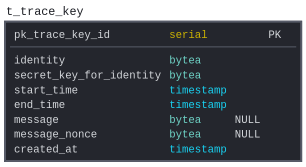
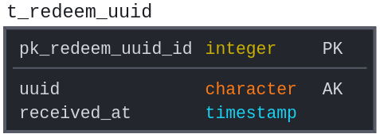
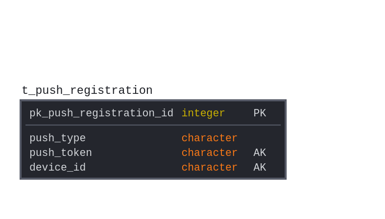

# NotifyMe SDK Backend

[](https://github.com/SwissCovid/swisscovid-cn-backend/blob/develop/LICENSE)

[](https://sonarcloud.io/dashboard?id=SwissCovid_swisscovid-cn-backend)

## Further Documentation

The full set of documents for CrowdNotifier is at https://github.com/CrowdNotifier/documents. Please refer to the technical documents and whitepapers for a description of the implementation.

## Dependencies

-   Spring Boot 2.4.0
-   Java 11 (or higher)
-   Logback
-   [Springboot-Swagger-3](https://bintray.com/ubique-oss/springboot-swagger3)

## Database

For development purposes a hsqldb can be used to run the webservice locally. For production systems, it is recommended to connect to a PostgreSQL dabatase (cluster if possible). There is a table for storing submitted trace keys. The schema is the following:





## Environments

To control different behaviors, SpringBoot profiles are used. The idea is to provide an abstract base class, which defines everything needed. Such properties can be defined as abstract, and their implementation can be provided in an extended class.

#### WSCloud\*Config/WSProdConfig/WSDevConfig

Currently four non-abstract configs (`dev`, `test`, `abn` and `prod`) are provided. Those are the CloudConfigs and they are optimized to work with an environment using KeyCloak and CloudFoundry.

Furthermore, two non-abstract configs (`dev`, `prod`) are provided, which implement a basic configuration, and which should work out-of-the-box.

> Note that the `dev` config uses a HSQLDB, which is non-persistent, whereas `prod` needs a running instance of PostgreSQL, either in a docker (a [docker-compose file](docker-compose/stack.yml) is provided) or native.

If you plan to provide new extensions or make adjustments and want to provide those to the general public, it is recommended to add a new configuration for your specific case. This can be e.g. an abstract class (e.g. WSCloudBaseConfig), which extends the base class providing certain needed keys or functions. If you provide an abstract class, please make sure to add at least one non-abstract class showing the implementation needed.

## API Requests

There are three endpoints, one for uploading VenueInfo objects, one for downloading trace keys and one for registering for push notifications. How long trace keys are stored in the database can be configured via the `db.removeAfterDays` property in the properties file. Please check the [proto](https://github.com/SwissCovid/swisscovid-cn-backend/tree/develop/swisscovid-cn-sdk-backend/swisscovid-cn-sdk-backend-model/src/main/resources/proto) folder for the corresponding protobuf schemas.

-   /v3/traceKeys?lastBundleTag=\<lastSync\>: `GET` Returns a list of trace keys in a ProblematicEventWrapper protobuf. The optional `lastBundleTag` is returned in each response as response header `x-key-bundle-tag` from the backend and should be used by clients for the following request. If set, only keys added since the last download are retrieved.

-   /v3/register: `POST` Register for push notifications. The request body should consist of a PushRegistration protobuf.

-   /v3/userupload: `POST` Upload a list of VenueInfo objects as a UserUploadPayload to be transformed into and stored as trace keys. Note that the request should include a valid JWT token, which can be obtained in exchange for a valid authentication code.

### Swagger

We use [Springboot-Swagger-3](https://github.com/Ubique-OSS/springboot-swagger3) to generate a `YAML` based on settings and controllers found in the project. We include a up-to-date version in each release. Currently they are lacking the documentation, but should provide enough information to use them in [Swagger Editor](https://editor.swagger.io).

## Build

To build you need to install Maven.

```bash
cd swisscovid-cn-sdk-backend
mvn install
```

## Run

```bash
java -jar swisscovid-cn-sdk-backend-ws/target/swisscovid-cn-sdk-backend-ws.jar
```

## Dockerfiles

The dockerfile includes a base jdk image to run the jar. To actually build the docker container, you need to place the generated jar in the bin folder.

```bash
cp swisscovid-cn-sdk-backend/swisscovid-cn-sdk-backend-ws/target/swisscovid-cn-sdk-backend-ws.jar swisscovid-cn-ws/ws/bin/swisscovid-cn-sdk-backend-ws-2.0.0.jar
```

```bash
cd swisscovid-cn-ws && docker build -t <the-tag-we-use> .
```

```bash
docker run -p 80:8080 -v <path_to_logbackxml>:/home/ws/conf/swisscovid-cn-sdk-backend-ws-logback.xml -v <path_to_application_properties>:/home/ws/conf/swisscovid-cn-sdk-backend-ws.properties <the-tag-we-use>
```

## Makefile

You can use the provided makefile to build the backend, build a docker image and generate the documentation.

Without a target, the makefile will generate everything except the docker image.

```bash
make
```

To build the docker image run

```bash
make docker-build
```

This will build the jar and copy it into the `swisscovid-cn-ws/ws/bin` folder, from where it is then added to the container image.
The image will be tagged as `swisscovid-cn-docker`.

An example `logback.xml` is found in the `resources` folder for the `swisscovid-cn-sdk-backend-ws` Java module.

An example `application.properties` file is found at the same location.
Just make sure the configuration matches with your deployment (c.f. `WSBaseConfig` for possible properties
and `WSCloudBaseConfig` for some `CloudFoundry` specific properties)

## License

This project is licensed under the terms of the MPL 2 license. See the [LICENSE](LICENSE) file.
